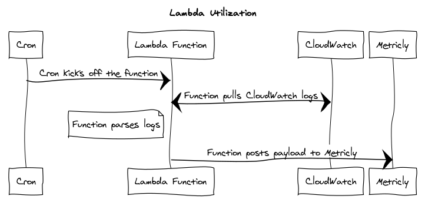

# Lambda Utilization



## Description

This project produces a Lambda function which parses Lambda function CloudWatch logs to pull billable duration and memory metrics. It's primarily used to calculate a **memory utilization** metric calculated off the max used and billable memory values. These values are then sent to Metricly. The CloudFormation template is the easiest way to start using the project.

### Workflow

The basic workflow of the function is as follows:

- A cron (the default is to run once every 5 minutes) kicks off execution of the Lambda function
- The Lambda function collects REPORT logs (the last line of each execution's logs reporting the usage) **from two durations to one duration ago** (e.g. 10 min to 5 min ago for the default) as logs take a few moments to be available in search and we don't want to miss them
  - Logs are paged, so high throughput functions may cause high Lambda Utilization run times
- Each log from CloudWatch is parsed and produces Metricly samples
- Samples from all logs are collapsed into a single Metricly ingest payload and sent to Metricly

## Setup

### Lambda

Run the following:
```
yarn install
yarn run build
yarn run zip
```

You will get a local zip. Upload this to AWS Lambda with an execution role which has CloudWatch Full Access. Configure it with 128 MB of RAM.

### CloudWatch Event Setup

This project runs best on a cron schedule. It will query and parse logs for each function name you provide. Running on a 5 minute rate is recommended.

To set up the CloudWatch Event go to the Lambda Utilization function in the AWS console and add a "CloudWatch Events" trigger to the function. Create a name for the trigger and configure a rate such as `rate(5 minute)`. This duration is needed in the environment variables below. After setting up the trigger enable it and save the function.

### Environment Variables

- **DURATION** (default: 60000) - Rate, in milliseconds, the lambda function is configured to run at
- **FUNCTION_NAMES** - Comma-delimited list of function names Lambda Utilization should monitor
- **METRICLY_API_KEY** - Metricly Custom integration API key (see https://app.metricly.com/#/profile/integrations for your key)

### Web Sequence Diagrams Source

```
title Lambda Utilization

Cron->Lambda Function: Cron kicks off the function
Lambda Function<->CloudWatch: Function pulls CloudWatch logs
Note left of Lambda Function: Function parses logs
Lambda Function->Metricly: Function posts payload to Metricly
```
